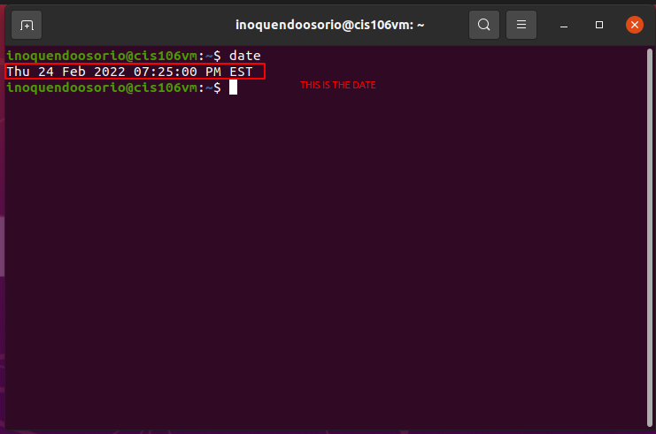
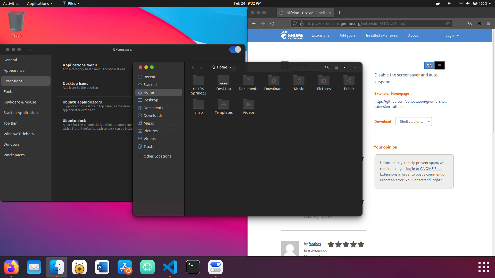
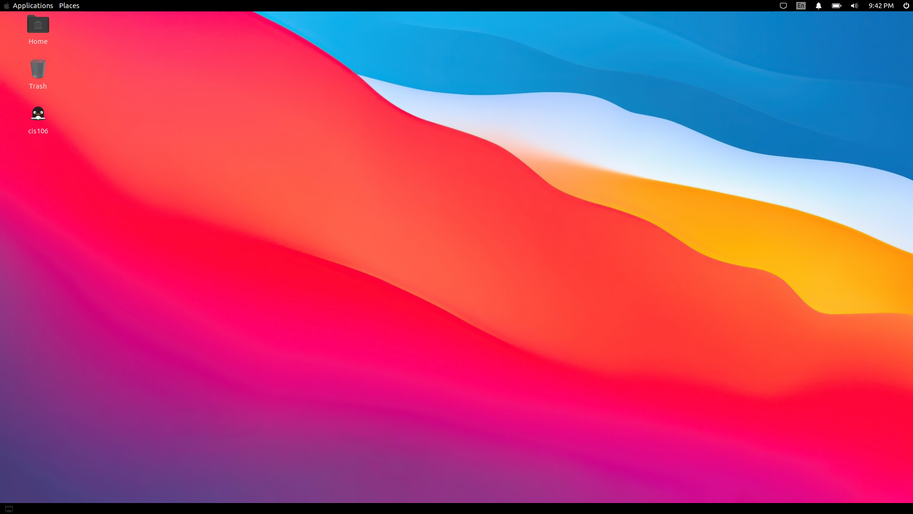

# Lab 3 Using Ubuntu

# Question 1

# Question 2

# Question 3

| Program purpose     | Package Name | Version | Description |
| ------------------- | ------------ | ------- | ----------- |
| Play a tetris game  | games-teris  | 2.2ubuntu3 |  Debian's tetris-like games           |
| Play a video file   | dragonplayer |  4:19.12.3-0ubuntu1       |   simple video player          |
| Browse the internet |  midori      | 7.0-2.1        |   ast, lightweight graphical web browser          |
| Read your email     |   geary      |    3.36.1-1     |     lightweight email client designed for the GNOME desktop  |
| Play music          |   lollypop   | 1.2.35-1  | modern music player      |

Commands Answers:
* Sub question 1: `sudo apt install games-tetris dragonplayer midori geary lollypop -y`
* Sub question 2: `sudo apt remove games-tetris dragonplayer midori geary lollypop -y`
* Sub question 3: `sudo apt install games-teris+ dragonplayer+ midori- geary- lollypop- -y`

# Question 4

| command | what it does |
|---------|--------------|
| echo    |   display a line of text  |
| fortune |   prints a random, hopefully interesting, adage  |
| cowsay  |   Cowsay generates an ASCII picture of a cow saying something provided by the user.   |
| lolcat  |   lolcat  is  a program that concatenates files, or standard input, to standard output (like the generic cat), and adds rainbow coloring to it. |
| figlet  |   FIGlet is a program for making large letters out of ordinary text     |
| toilet  |   TOIlet  prints  text  using  large characters made of smaller characters. It is similar in many ways to FIGlet with additional features such as Unicode handling, colour fonts,  fil‐ters and various export formats.  |
| rig     |   Rig  is  a  utility that will piece together a random first name, last name, street number and address, along with a geographically consistant (ie, they all  match  the  same  area) ity, state, ZIP code, and area code. |