# Lab 4

### Question 1: The linux filesystem

**Create a table that includes the following directories and their usage:**
#### Table1
| Directory | Function |
| ------------------- | ------------ | ------- | ----------- |
| bin | Essential commands |
| dev | Device files |
| etc | System configuration files |
| home | User home directories |
| media | Mount point for removable media, such as DVDs and floppy disks |
| opt | Add-on software packages |
| proc | Kernel information, process control system hardware information |
| srv | Information relating to services that run on the system |
| usr | Software not essential for system operation, such as applications |

**Create a table of the commands used for navigating the file system (cd, pwd, ls). Your table must include the following:**

- The command,
- What the command does
- The syntax/formula of how to use the commands,
- An example

#### Table 2

| Command |	What it does	| Syntax| 	Example |
| -------| ------ | ------ | ----- |
| pwd | Used for displaying the current working directory. | pwd | Ex. pwd | cd | Used for changing the current working directory. When no directory is given, cd changes the current working directory to the current user's home directory.| cd + destination | Ex. cd ~/Downloads/
| ls | Used for displaying all the files inside a given directory. When no directory is specified, ls displays the files in the current working directory. | ls + destination | Ex. ls Music/

**Complete all the practice located in the presentation (including the challenge). Take a screenshot of your terminal after every practice.**

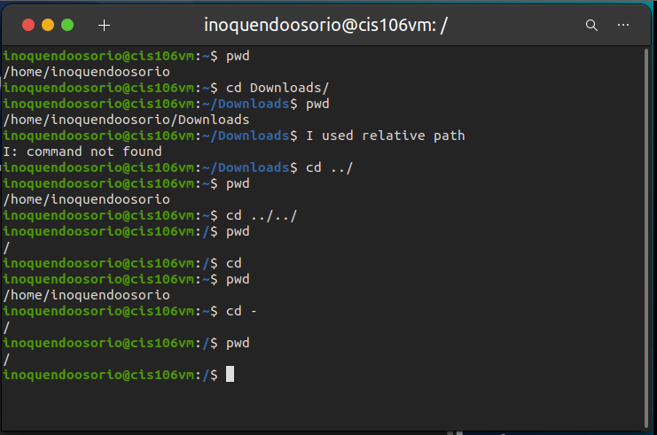

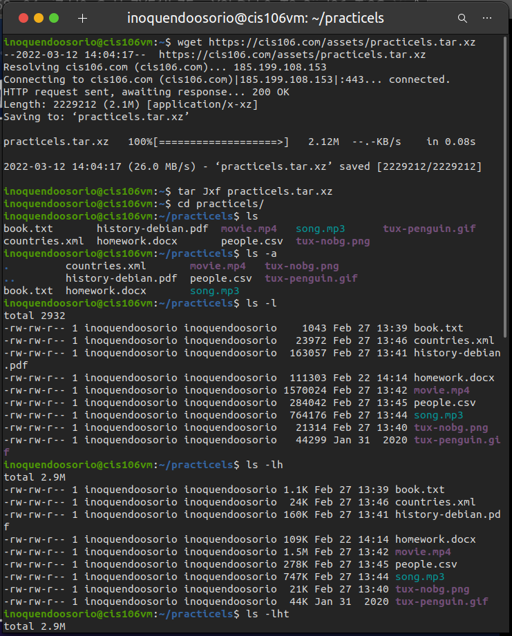

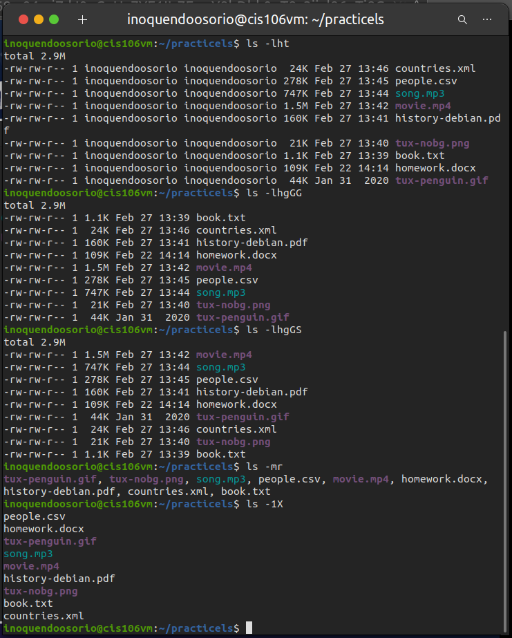

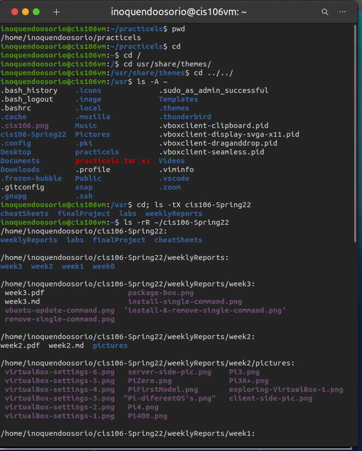

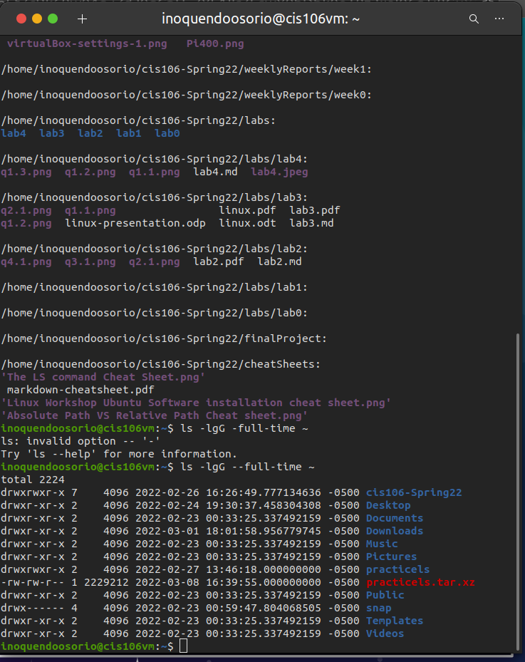

### Question 2 | The pwd and cd command 
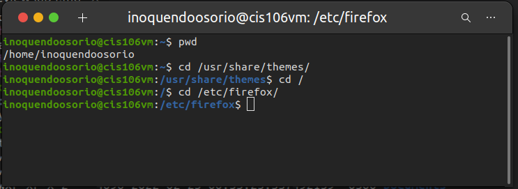 
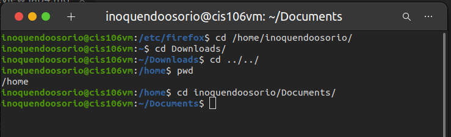 

### Question 3 | The ls command 
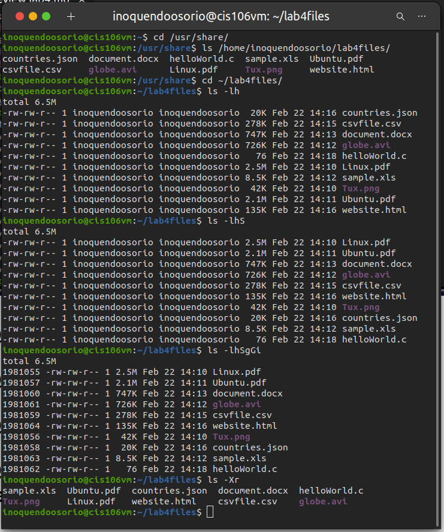 

### Question 4 | The tree command
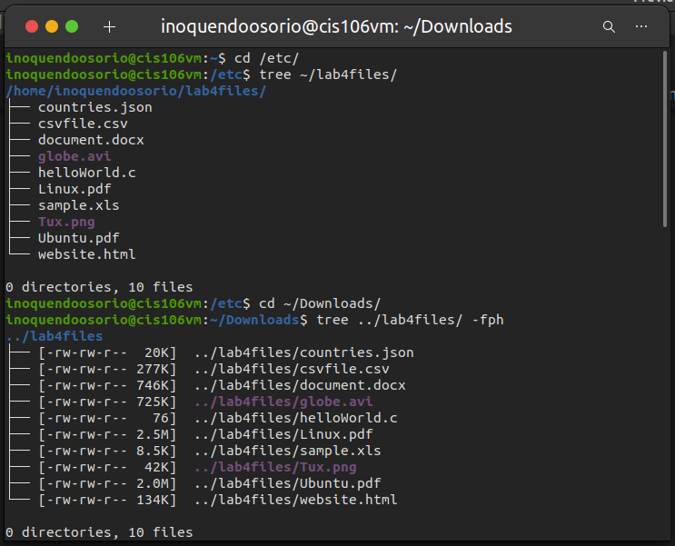 
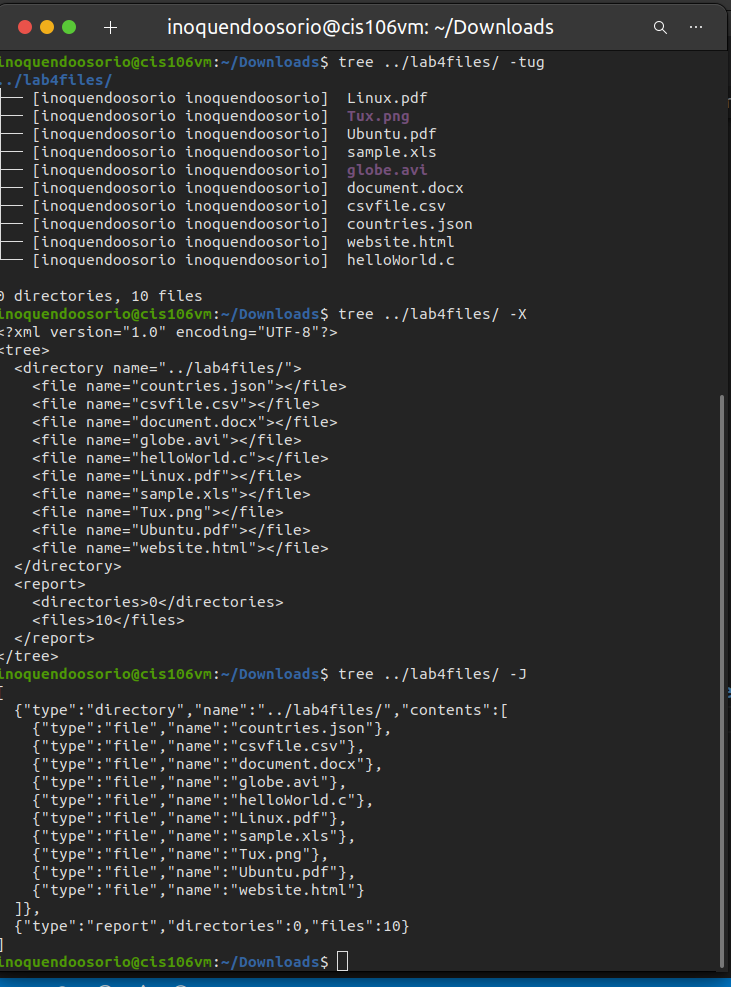 
### Question 5 | The exa command. A modern tool to replace ls

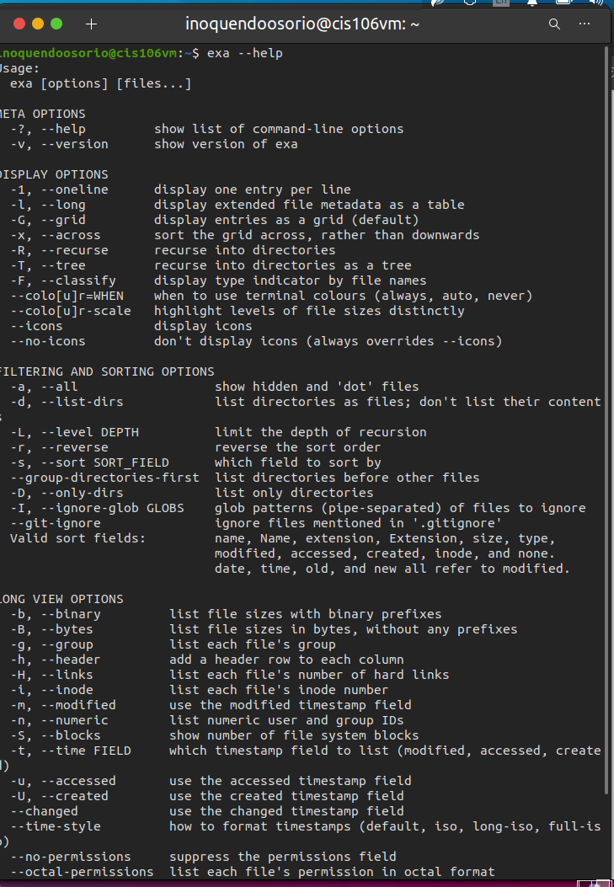 
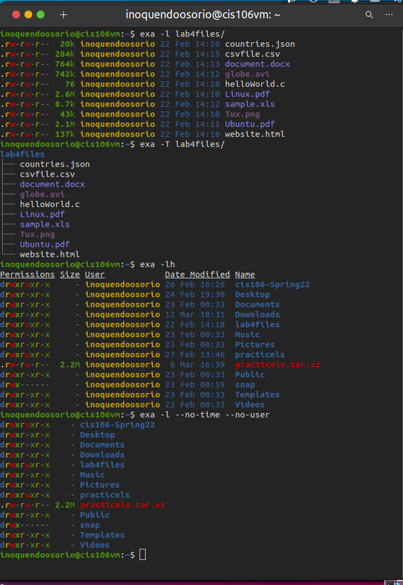 