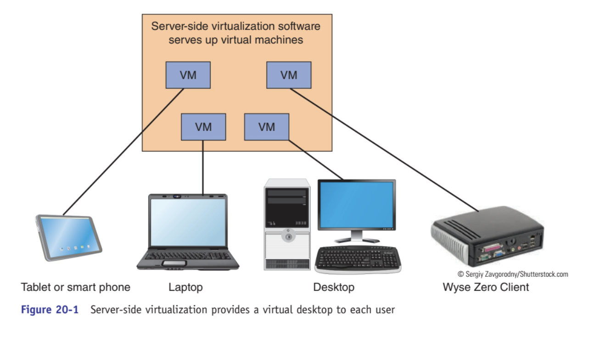
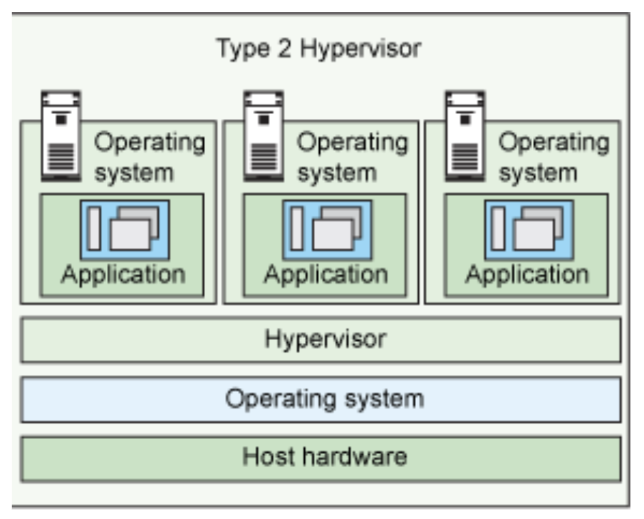

# Week Report 2
## Summary of Presentations

### The basics of virtualization

 * **What is virtualization**
  > Replication on hardware to simulate virtual machines inside a physical machine
* **Types of virtualization**
  >client-side virtualization
  >server-side virtualization
  
 _The big difference between this two is where the virtualization takes place. That's it!_

---
# Server-side virtualization

 * For example:  Our school uses this server-side platform using (VMware ESXi) with (VDI) virtual desktop infrastructure. And provides "Thin clients" and "Zero clients" for students in the classrooms.

 ---

# Client-side virtualization

* Software installed on a computer to manage virtual machines
* For client-side virtualization, the computer needs: 
  * A hypervisor (software that allows the management of virtual machines)
  * Hardware support
* Capable CPU
* Enough Ram
* Enough Storage
 

* #### For this course we will be using Type 2 Hypervisor. 
Which is software that runs on a Host Operating System. Ex:
>VMware Workstation Player/Pro
>Oracle VirtualBox
* #### For the course We will use: Oracle VirtualBox
## Some of the benefits of virtualization are:

* Allows multiple OS.
* Allows applications to be tested before installing them on a host machine.
* Reduces the costs by decreasing the physical hardware that must be purchased for a network.
* Offers the chance to experiment with untested programs without infecting machines with malicious software or viruses.